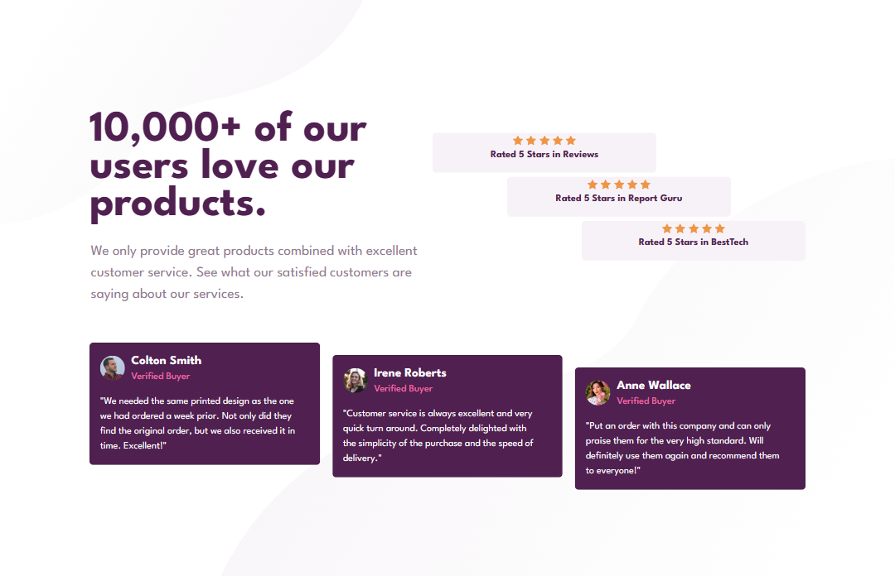
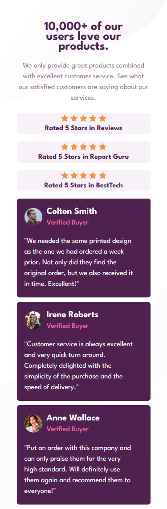

# Frontend Mentor - Social proof section solution

This is a solution to the [ Social proof section challenge on Frontend Mentor.](https://www.frontendmentor.io/challenges/social-proof-section-6e0qTv_bA). Frontend Mentor challenges help you improve your coding skills by building realistic projects.

## Table of contents

- [Overview](#overview)
  - [The challenge](#the-challenge)
  - [Screenshot](#screenshot)
  - [Links](#links)
- [My process](#my-process)
  - [Built with](#built-with)
  - [Continued development](#continued-development)
- [Author](#author)

## Overview

### The challenge

Users should be able to:

- View the optimal layout for the section depending on their device's screen size.

### Screenshot

|  |  |
| ------------------------------ | ----------------------------- |
| Desktop version                | Mobile version                |

### Links

- Solution URL: [Code on GitHub](https://github.com/hatemhenchir/Social-proof-section)
- Live Site URL: [GitHub Pages Live URL](https://hatemhenchir.github.io/Social-proof-section/)

## My process

Worked on displaying the layout as given in the design.
Added media queries for smaller devices to show optimal layout to the user.

### Built with

- Semantic HTML5 markup
- CSS custom properties
- Flexbox
- Bootstrap 5

### Continued development

Will do more of these challenges to improve my skills.

## Author

- Frontend Mentor - [@hatemhenchir](https://www.frontendmentor.io/profile/hatemhenchir)
- Linkedin - [@hatem-henchir-7a92141a8](https://www.linkedin.com/in/hatem-henchir-7a92141a8/)
